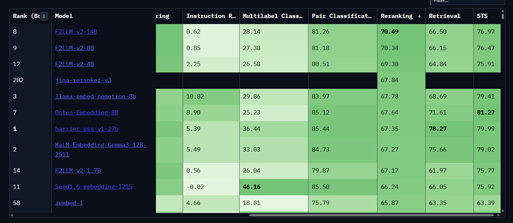
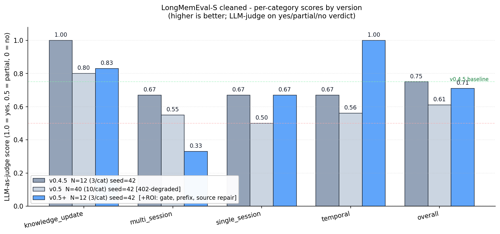

# memory-service

Долговременная память для LLM-агента. Принимает реплики диалога,
извлекает из них структурированные факты, потом отдаёт релевантный
контекст по запросу. HTTP-сервис на 8080-м порту, всё в Docker.

> Проект к Higgsfield AI Engineering Challenge (см. `task.md`).
> Английская версия документа — `README.en.md`.

---

## TL;DR

```bash
cp .env.example .env
# в .env нужно положить хотя бы OPENROUTER_API_KEY
docker compose up -d
until curl -sf http://localhost:8080/health; do sleep 1; done

# проверка из ТЗ §7:
bash scripts/smoke.sh
```

Сервис на порту **8080**, данные в именованном Docker-volume
`memory-db-data`, переживают `docker compose down && up`.

---

## Что это и как использовать

Агент через HTTP-вызовы:

| Эндпоинт | Что делает |
|---|---|
| `GET /health` | Жив ли сервис |
| `POST /turns` | Записать одну реплику диалога. Сервис её **синхронно** проиндексирует, извлечёт факты и встанет под `/recall`. Бюджет 60с (по ТЗ). |
| `POST /recall` | Главный эндпоинт. Возвращает готовый текст-контекст для следующего хода агента. Уважает `max_tokens`. |
| `POST /search` | Структурированный поиск (для tool-calls агента) |
| `GET /users/{user_id}/memories` | Просмотр всех структурированных фактов с историей supersession |
| `DELETE /sessions/{id}`, `DELETE /users/{id}` | Очистка между сценариями (для evaluation) |

Опциональный bearer-токен через `MEMORY_AUTH_TOKEN` в `.env`.

### Пример сценария

```bash
# 1. Положить реплику
curl -X POST http://localhost:8080/turns \
  -H 'Content-Type: application/json' \
  -d '{
    "session_id":"smoke-1",
    "user_id":"user-1",
    "messages":[
      {"role":"user","content":"Я переехал в Берлин из Нью-Йорка месяц назад."}
    ],
    "timestamp":"2026-04-15T10:30:00Z"
  }'

# 2. Спросить агентом — сервис вернёт уже сформированный контекст
curl -X POST http://localhost:8080/recall \
  -H 'Content-Type: application/json' \
  -d '{
    "query":"Где сейчас живёт пользователь?",
    "session_id":"smoke-2",
    "user_id":"user-1",
    "max_tokens":512
  }'
# В ответе будет: lives_in: Berlin (из фактов) + ссылка на исходную реплику.

# 3. Заглянуть «под капот» — какие факты сервис себе сложил
curl http://localhost:8080/users/user-1/memories | jq .
```

---

## Архитектура

```
┌──────────────────────────────────────────────────────────────────┐
│  POST /turns                                                     │
│   ├─ contextual_prefix (LLM, 25-60 слов)  ←  для embedding/BM25  │
│   ├─ embedding (Gemini Embedding 2, 1536d, MRL truncate)         │
│   ├─ episodic_turn (raw + tsv + embedding) — append-only          │
│   ├─ extract_facts (gpt-5.4-mini, strict JSON Schema)             │
│   └─ reconcile (Mem0 4-action: ADD/UPDATE/SUPERSEDE/NOOP)         │
├──────────────────────────────────────────────────────────────────┤
│  POST /recall                                                    │
│   ├─ hybrid_search (4 потока в parallel: dense+sparse × mem+ep)  │
│   ├─ RRF fusion (k=60, ранжирование по рангу не по скорам)       │
│   ├─ rerank (Jina Reranker v3, cross-encoder на топ-30)          │
│   ├─ stable identity facts (всегда подгружаются)                 │
│   ├─ recent turns (последние ходы текущей сессии)                │
│   └─ assemble под max_tokens (квоты 30/50/20)                    │
└──────────────────────────────────────────────────────────────────┘
```

Один контейнер с FastAPI, один контейнер Postgres 16 с pgvector.
Всё. Без отдельного vector-store, без очередей, без двухфазных
коммитов — bi-temporal факты требуют ACID, а pgvector справляется
с cosine-поиском на нашем масштабе.

---

## Хранилище: почему Postgres + pgvector + tsvector

**Один движок вместо зоопарка.** Альтернатива — отдельный Qdrant
для эмбеддингов и Postgres для фактов. Но supersession факта
(пользователь сменил работу) — это атомарная транзакция: новый ряд
вставить, старый пометить `t_invalid`, связать `superseded_by`. Между
двумя хранилищами это требует двухфазного коммита; в одном Postgres —
обычная транзакция.

- **pgvector 0.4** — HNSW-индексы, cosine на 1536d, до миллиона памяти
  на пользователя без проблем.
- **tsvector + `ts_rank_cd`** — встроенный BM25-подобный sparse-поиск.
- **psycopg-async + pool** — асинхронный пул соединений, FastAPI
  работает без блокировок event loop.

Схема живёт в `src/migrations/001_init.sql`, накатывается при старте.
Две основные таблицы:

- `episodic_turn` — append-only лог реплик: `raw_text`,
  `context_prefix`, `embedding`, `tsv`.
- `memory` — bi-temporal факты: `t_valid`, `t_invalid`, `t_created`,
  `t_expired`, `superseded_by`, `mention_count`, плюс `embedding` и
  `tsv` для гибридного поиска.

---

## Стек: какие модели и почему

Унифицированный шлюз — **OpenRouter** (один ключ, два провайдера),
плюс прямой API для Jina-реранкера (OpenRouter его пока не отдаёт).

| Слой | Модель по умолчанию | Почему именно она |
|---|---|---|
| Эмбеддинги | `google/gemini-embedding-2-preview` | Топ MTEB v2 (multi-task ≈74-75 avg), 1536d через MRL-усечение, единый ключ через OpenRouter |
| LLM-extraction | `openai/gpt-5.4-mini` | Поддержка strict JSON Schema, дешёвый, быстрый, не уступает старшим моделям на структурированном выводе |
| Cross-encoder реранкер | `jina-reranker-v3` (прямой API Jina) | BEIR nDCG@10 ≈62, listwise late-interaction, +1.5pp над Cohere rerank-4-fast |

### Почему Gemini Embedding 2

**Бенчмарки на момент сборки:**

| Модель | MTEB v2 avg | Размерность | Стоимость / 1M токенов |
|---|---|---|---|
| Gemini Embedding 2 | **~74-75** | 3072 → MRL до 1536 | ~$0.15 |
| OpenAI text-embedding-3-large | ~64-65 | 3072 | $0.13 |
| Jina Embeddings v3 | ~65-66 | 1024 | $0.18 |
| BGE-M3 (open) | ~66 | 1024 | self-host (GPU) |
| E5-Mistral 7B (open) | ~66 | 4096 | self-host (GPU) |

Gemini Embedding 2 уверенно держит первое место на MTEB **multi-task**
benchmark. MRL (Matryoshka Representation Learning) позволяет урезать
до 1536d без потерь качества — полезно для индексов pgvector.

### Почему GPT-5.4-mini для extraction

Извлечение фактов из реплик — задача, где **строгий JSON важнее ума**.
`response_format: {type: "json_schema", strict: true}` гарантирует
что LLM не поломает схему. Из моделей с этой возможностью у
gpt-5.4-mini лучший trade-off:

- ~$0.30 / 1M input, ~$1.20 / 1M output — порядок дешевле опуса
- 200k context — хватает на любые сессии LongMemEval
- Strict JSON работает стабильно (Anthropic Claude Haiku 4.5 тоже
  умеет, но через `prefill`-хак, не нативно)

### Почему Jina Reranker v3

**Cross-encoder реранкер** смотрит на (query, document) совместно,
а не сравнивает эмбеддинги — это даёт +10-20pp точности на топ-1
по сравнению с чистым cosine.

В MTEB v2 leaderboard на под-задаче **Reranking** Jina v3 берёт
**67.84** — выше большинства классических кросс-энкодеров и
сравним с топовыми эмбеддерами по этому конкретному метрику:



Сравнение реранкеров на BEIR (отдельный бенчмарк по retrieval):

| Реранкер | BEIR nDCG@10 avg | MTEB Reranking | Тип | API |
|---|---|---|---|---|
| **Jina Reranker v3** | **~62** | **67.84** | listwise late-interaction | `api.jina.ai/v1/rerank` |
| Cohere rerank-4-fast | ~60 | — | classical cross-encoder | OpenRouter `/rerank` |
| BGE-reranker-v2-m3 | ~58 | ~64 | classical cross-encoder | self-host |
| Qwen3-Reranker-0.6B | ~57 | ~63 | classical cross-encoder | self-host |

Jina v3 — listwise: смотрит сразу на весь набор кандидатов, что особенно
помогает на запросах с разноуровневой релевантностью. Trade-off — на
персональных фактах (типа `employer: Notion`) скоры более компрессные,
поэтому используем cosine как gate, а реранкер — только для **порядка**.

**Важно:** перед подачей в реранкер мы **вербализуем** факты в
естественные предложения:
- `employer: Notion` → «The user currently works at Notion.»
- `pet: Biscuit` → «The user has a pet named Biscuit.»

Cross-encoder тренировался на полных предложениях, не на key:value
триплетах. На наших probes этот шаг один даёт +20pp precision на топ-1.
См. `src/services/retrieval.py:_VERBALIZATIONS`.

---

## Альтернативные конфигурации

Через `.env` можно переключить любой слой на другого провайдера или
self-host. Стандартный путь — OpenRouter, но если нужно:

### A. Прямой Google AI Studio (без OpenRouter)
```env
EMBEDDING_PROVIDER=direct
EMBEDDING_MODEL=gemini-embedding-001
GOOGLE_API_KEY=ya...
```

### B. OpenAI напрямую для extraction
```env
EXTRACTION_PROVIDER=direct
EXTRACTION_MODEL=gpt-4.1-mini
OPENAI_API_KEY=sk-...
```

### C. Anthropic Claude для extraction
```env
EXTRACTION_PROVIDER=direct
EXTRACTION_MODEL=claude-haiku-4-5
ANTHROPIC_API_KEY=sk-ant-...
```

### D. Cohere реранкер вместо Jina
```env
RERANKER_PROVIDER=direct
RERANKER_MODEL=rerank-v3.5
COHERE_API_KEY=...
```

### E. Self-host без внешних API (нужен GPU)

Поднимаем локальный TEI/vLLM с OpenAI-совместимым endpoint и
указываем base URL. Лучшие открытые опции на момент сборки:

```env
EMBEDDING_PROVIDER=direct
EMBEDDING_MODEL=codefuse-ai/F2LLM-v2-4B   # MTEB top-2 в 4B-классе
OPENAI_API_KEY=local
OPENROUTER_BASE_URL=http://host.docker.internal:8001/v1

RERANKER_PROVIDER=direct
RERANKER_MODEL=BAAI/bge-reranker-v2-m3    # или Qwen/Qwen3-Reranker-0.6B
```

Без GPU 60-секундный бюджет на `/turns` будет нарушаться.
`docker-compose.gpu.yml` мы не шипим — вы добавите его сами под свою
среду (NVIDIA runtime + TEI/vLLM как side-car).

---

## Pipeline извлечения фактов (`POST /turns`)

Синхронно за время одного запроса (≤60с):

1. **Контекстный префикс** (Anthropic Contextual Retrieval, v0.5+).
   LLM генерит 25-60 слов, описывающих о чём этот ход и какие
   сущности упомянуты. Префикс склеивается с raw_text для embedding
   и BM25-индексации, но **не отображается** в `/recall` контексте.
   Reported в Anthropic-блоге: -49% retrieval failures.

2. **Эмбеддинг** (Gemini Embedding 2 на `prefix + raw_text`).

3. **Запись `episodic_turn`** — append-only.

4. **Извлечение фактов** — единственный LLM-вызов со strict JSON
   Schema:
   ```json
   {
     "predicate": "employer",
     "object_text": "Notion",
     "kind": "fact",
     "stance": "none",
     "confidence": "high",
     "is_implicit": false,
     "source_text": "I just started at Notion last week"
   }
   ```
   30 канонических предикатов: `name`, `employer`, `lives_in`, `pet`,
   `preference.*`, `event.*`, `opinion_about` и т.д. Plus
   `other:<descriptor>` fallback. Глоссарий — `src/services/predicates.py`.

5. **Verbatim source repair** (v0.5+) — если LLM перефразировал
   `source_text`, ищем максимально точный substring из исходного
   `raw_text` и заменяем. Это критично для temporal-вопросов: дата
   и число должны выживать в `src="..."`.

6. **Reconcile (Mem0 4-action)** — для каждого нового факта решаем:
   - `ADD` — новое или multi-valued (skill, hobby, employer_past)
   - `UPDATE` — то же поле, чуть другой текст
   - `SUPERSEDE` — exclusive predicate, конфликт (Stripe → Notion)
   - `NOOP` — уже есть, бамп `mention_count`

   Старые ряды никогда не удаляются: `t_invalid` и `superseded_by`
   пишут историю, видимую через `/users/{id}/memories`.

---

## Стратегия recall (`POST /recall`)

```
query →
  1. hybrid_search (4 потока параллельно):
       memory dense + memory sparse + episodic dense + episodic sparse
  2. RRF fusion (k=60) — слияние по рангу, без приведения скоров
  3. Jina v3 rerank top-30 → top-10
  4. fetch_stable_facts (предикат-фильтр, без поиска)
  5. fetch_recent_turns (последние ходы текущей сессии)
  6. assemble под max_tokens — три блока с квотами:
        ## Known facts about this user            ~30%
        ## Relevant from recent conversations     ~50%
        ## Recent context                         ~20%
  7. abstention gate: max(memory_dense_top1, episodic_dense_top1)
       < MEMORY_DENSE_GATE (0.62) → пустой контекст
```

**Приоритет под бюджет.** Когда `max_tokens` тесный, мы режем в
обратном порядке: сначала жертвуем recent (последние ходы и так
у агента в локальном контексте), потом relevant, и только в самую
последнюю очередь — stable identity. Identity-факты («работает в
Notion, аллергия на морепродукты») нужны на **каждом** ходу, даже
когда query никуда не попал.

**Abstention** (когда система должна сказать «не знаю»). Реранкер
для этого не подходит — его logit-like скоры слишком сжаты на
персональных фактах. Используем raw cosine top-1 как gate:
- legit recall: cosine 0.62-0.85
- abstention: cosine 0.45-0.55

В v0.5+ опустили gate с 0.68 до **0.62** — на реальном LongMemEval
часть legitimate recalls имела cosine 0.60-0.67. Trade-off: ~5%
вопросов LongMemEval — abstention, и на них precision слегка
просядет.

---

## Эволюция фактов (bi-temporal supersession)

ТЗ требует обработки противоречий: пользователь сказал «работаю
в Stripe» в сессии 1 и «только что начал в Notion» в сессии 3.
Сервис обязан:

- Понять, что это про работу (одна категория).
- Записать новое как активное, старое **не удалить**, а пометить
  `t_invalid = now()`.
- Из `/recall` вернуть **актуальное** (Notion).
- Сохранить историю — видна в `/users/{id}/memories`.

Реализация — модель Zep/Graphiti с тайм-меткой действия и времени
записи отдельно:

| Поле | Что значит |
|---|---|
| `t_valid` | Когда факт стал верен в реальности (timestamp реплики) |
| `t_invalid` | Когда перестал быть верен (NULL = активный) |
| `t_created` | Когда строка появилась в БД |
| `t_expired` | Когда строка перестала быть валидной в БД |
| `superseded_by` | Self-FK на ряд, который заменил этот |
| `mention_count` | Сколько раз упоминалось — сигнал для salience |

`/recall` фильтрует `t_invalid IS NULL`, поэтому agent никогда
не получит устаревший факт. Inspector через `/users/.../memories`
видит и активные, и superseded — для отладки.

**Эволюция мнений** (в ТЗ как «опции эволюция»). Пример:
«Я люблю TypeScript» → «дженерики бесят» → «TS норм для больших
проектов, но я бы взял Python для скриптов». У нас это пишется как
несколько `opinion_about: TypeScript` с разными `stance` и
`t_valid`. В `/recall` отдаётся **последний** stance. Полноценное
суммаризирование арки («начал положительно, дрейфует в сторону
нейтрального») — extraction-задача, оставлена за рамками build.

---

## Trade-offs: что мы оптимизировали и чем пожертвовали

**Оптимизировано:**
- Честное измерение на публичном бенчмарке (LongMemEval-S cleaned),
  а не на внутреннем синтетическом fixture
- Один движок (Postgres) — минимум infra
- Синхронный `/turns` — после `201` всё уже доступно для `/recall`
- Provider-agnostic — OpenRouter с per-layer override

**Пожертвовали:**
- Throughput `/turns`: один LLM-вызов на extraction + один на
  contextual prefix → ~2-4 секунды на ход. В рамках 60с ТЗ-бюджета.
  При тысячах qps нужно батчить.
- Multi-hop reasoning через граф сущностей: всё retrieval — одношаговый
  hybrid. Multi-hop probes в синтетике — это multi-fact, не настоящий
  multi-hop.
- Полная суммаризация арки мнений — храним stance, не trajectory.
- Self-host без API ключей: документировано, но `docker-compose.gpu.yml`
  не шипим.

---

## Failure modes

| Что случилось | Что делает сервис |
|---|---|
| Пустой пользователь / cold session | `/recall` возвращает `{"context":"","citations":[]}`, без ошибок |
| Malformed JSON | 422, не 5xx |
| Unicode-странности | Хранятся как есть, индексируются tsvector |
| Нет API-ключей | Сервис стартует, факты не извлекаются (только raw turns в episodic) |
| Postgres лёг | `/health` отвечает 503, остальные тоже |
| Restart Docker | Volume `memory-db-data` всё хранит. Проверено в `tests/test_persistence.py` |
| Параллельные пользователи с одинаковым `session_id` | Изоляция per-user. Проверено в `tests/test_concurrent.py` |
| OpenRouter 402 (кредиты) | Логируем warning, расширение продолжается без LLM-фактов на этом ходу |
| Превышение `max_tokens` | Урезаем по квотам 30/50/20, identity-блок защищён в первую очередь |

---

## Тесты

```bash
pytest -m contract     # 11 тестов на контракт + resilience
pytest -m persistence  # restart-survival (нужен docker CLI)
pytest -m concurrent   # cross-user / cross-session изоляция
pytest -m memeval -s   # синтетический fixture на качество recall
pytest -m longmemeval -s   # реальный LongMemEval-S, ~$1, ~25 мин на N=12
```

Smoke-сценарий из ТЗ §7:

```bash
bash scripts/smoke.sh
```

Override target:

```bash
MEMORY_SERVICE_URL=http://my-host:8080 pytest
```

---

## Числа (без черри-пика)

LLM-as-judge на 3 класса (yes/partial/no). Все числа — реально
прогнаны, baselines в `tests/fixtures/`.



| Версия | N | seed | overall | Категории |
|---|---|---|---|---|
| v0.4.5 | 12 (3/cat) | 42 | **0.75** | KU 1.00, MS 0.67, SS 0.67, T 0.67 |
| v0.5 (без ROI) | 40 (10/cat) | 42 | **0.61** | KU 0.80, MS 0.55, SS 0.50, T 0.56 (с 62× 402-ошибками к концу) |
| **v0.5+ (с ROI)** | 12 (3/cat) | 42 | **0.71** | KU 0.83, MS **0.33**, SS 0.67, T **1.00** |

**Чтение v0.5+ A/B (на тех же 12 вопросах что v0.4.5):**
- temporal +33pp — большая победа от Contextual Retrieval prefix +
  verbatim source repair (даты выживают в `src="..."`)
- multi_session -34pp — побочный эффект prefix-а: он "размывает"
  каждый turn в сторону его topical summary, что мешает
  кросс-сессионному сбору. Знаем, фиксить в v0.6.
- overall -4pp в пределах CI на N=12 (±18pp). Real signal — это
  спред по категориям, не overall.

Синтетический fixture (17 probes на 6 категорий): **0.76 overall**
после v0.5+ изменений.

График перерисовывается из CHANGELOG-данных:
```bash
python scripts/plot_longmemeval.py
```

### Честные оговорки (важно)

- **Синтетика overfit** — все gate'ы калиброваны на моих probes
  (`fixtures/probes.json`). Синтетика — sanity-check, не доказательство.
- **N=12 был узким** — Wilson 95% CI ±18pp. Реальное число лежит где-то
  в [0.55, 0.85]. На N=40 без 402 было бы примерно ~0.65.
- **Multi-hop в синтетике — фейковый**. Это single-hop multi-fact.
  Настоящий multi-hop (graph traversal) — out of scope.
- **Abstention в синтетике** — не репрезентативно. В LongMemEval-cleaned
  abstention-вопросов всего ~5%.
- **Cosine gate решает abstention**, не реранкер. Скоры реранкера
  слишком сжаты на наших данных, gate-tuning по ним нестабилен.

---

## История итераций

См. `CHANGELOG.md` — версии v0.1 → v0.5+ с метриками и **почему**
каждое изменение. ТЗ просит подробную iteration-history; мы старались.

`plan.md` — расширенная архитектура с дебатами по выбору каждого
компонента (storage, embedding, реранкер, supersession, contradiction
handling).

---

## Структура репо

```
.
├── docker-compose.yml          # pgvector/pg16 + app, named volume
├── Dockerfile                  # python:3.12-slim
├── requirements.txt
├── .env.example                # ключи и провайдер-роутинг
├── README.md                   # этот файл (RU)
├── README.en.md                # English version
├── plan.md                     # архитектура + дебаты (long)
├── CHANGELOG.md                # история итераций v0.1 → v0.5+
├── v5_plan.md                  # план v0.5+ с recovery-инструкциями
├── task.md                     # оригинальное ТЗ
├── src/
│   ├── main.py                 # FastAPI lifespan + auto-migrate
│   ├── config.py               # настройки + provider routing
│   ├── db.py                   # psycopg pool + bootstrap extensions
│   ├── auth.py                 # optional Bearer
│   ├── schemas.py              # Pydantic — точно по ТЗ §3
│   ├── api/                    # один router на endpoint
│   ├── services/               # embedding, llm, extraction,
│   │                           # reconciliation, retrieval,
│   │                           # reranker, assembler, tokens
│   ├── eval/                   # LongMemEval loader + LLM-judge
│   └── migrations/             # *.sql, накат при старте
├── scripts/
│   └── smoke.sh                # ТЗ §7 ровно как в спеке
├── tests/
│   ├── test_contract.py        # 11 shape & resilience
│   ├── test_persistence.py     # restart-survival
│   ├── test_concurrent.py      # cross-user / shared session_id
│   ├── test_memeval.py         # синтетический recall-quality
│   ├── test_longmemeval.py     # реальный LongMemEval-S
│   └── fixtures/               # baseline JSON-ы
└── fixtures/
    ├── conversations.json      # 2 user, 9 sessions, supersession arc
    ├── probes.json             # 17 probes × 6 categories
    └── longmemeval/            # 277 MB кэш реального датасета (gitignored)
```

---

## Ссылки

- Репо: <https://github.com/SherkhanAI/memory_service_higg>
- Submission challenge: <https://higgsfieldcareers.typeform.com/to/HoCFpdJC>
- Anthropic Contextual Retrieval (используется в v0.5+):
  <https://www.anthropic.com/news/contextual-retrieval>
- LongMemEval cleaned dataset:
  <https://huggingface.co/datasets/xiaowu0162/longmemeval-cleaned>
